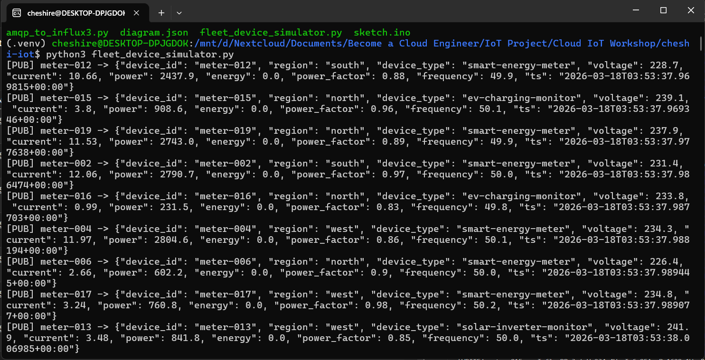
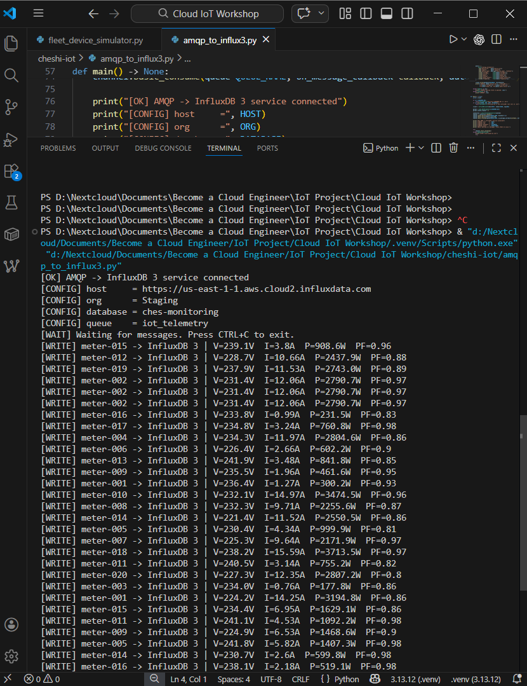
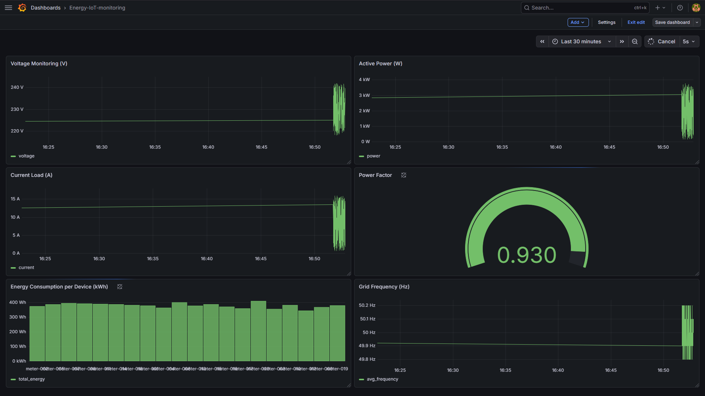

# Documentation

Visual evidence of the Energy Monitoring IoT Pipeline running end-to-end.

---

## 1. Producer — Mengirim Data ke LavinMQ

---

## 2. Consumer — Mengirim Data dari LavinMQ ke InfluxDB

---

## 3. Hasil Visualisasi Data di Grafana

